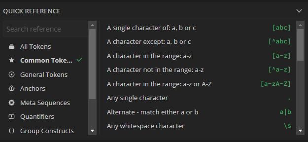
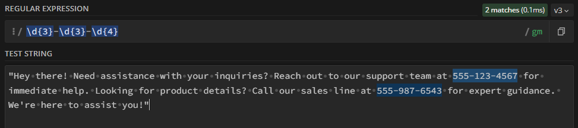
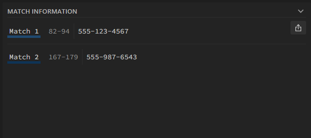

{: .no_toc}  
# Lesson 0 - Using RegEx101

This lesson goes over RegEx101, an interactive platform for building, testing, and debugging regular expressions.

  

    Table of Contents
  

  {: .text-delta }
- TOC
{:toc}

## Lesson Objectives
- Explore the features of RegEx101 for debugging and visualizing regular expressions.

<!-- ## Lesson Video
The following video demonstrates each of the steps outlined below in text.

<iframe height="416" width="100%" allowfullscreen frameborder=0 src="https://echo360.ca/media/a65689c0-c35c-4f33-9c12-f0ac97883f54/public?autoplay=false&automute=false"></iframe>
[View original here.](https://echo360.ca/media/a65689c0-c35c-4f33-9c12-f0ac97883f54/public?autoplay=false&automute=false) -->

## RegEx101

[RegEx101](https://regex101.com/) is an interactive regular expression console that lets you test your regular expressions on an extract of text, allowing you to debug and visualize your search patterns.

Besides letting you test your regular expressions, it comes with a few other tools that you might find helpful.

### Choosing the Flavor of Regular Expression

There are multiple implementations of regular expressions, resulting in some minor differences in behaviour. RegEx101 allows you to choose from a couple of these implementations, such as PCRE2, PCRE, ECMAScript, Python, GoLang, and more. If you're planning to use regular expressions in a specific environment that's also listed here, it's best to use that flavor. If it's not listed there, you can leave it on the default setting of PCRE2 -- the changes between versions are minimial and, in most cases, you won't encounter any errors.

### Explanation

The explanation tab will explain the different components of your inputted regular expression. This is really useful when first learning about regular expressions, but is also great for understanding regular expressions that originate from elsewhere. As an example, below is the explanation given for the `/\d{1,3}/gm` expression.

### Quick Reference

Finally, there's also the quick reference menu at the bottom right. This lets you search for and explore the different tokens that regular expressions has to offer. Clicking on any of them pulls up a longer explanation of the token, alongside a small example.

## Testing Regular Expressions

To test your regular expressions, you'll need to put your text extract in the bottom text box labeled "Test String". Then you can put your regular expression at the top, and you should begin to see all the matches in your text.

On the right hand side, you'll see a more detailed "Match Information" section, which lists all of the matches alongside their index. You can also export this information as a JSON, CSV, or plain text file.

## Key Points / Summary

- [RegEx101](https://regex101.com/) is an interactive regular expression console that lets you test your regular expressions.
