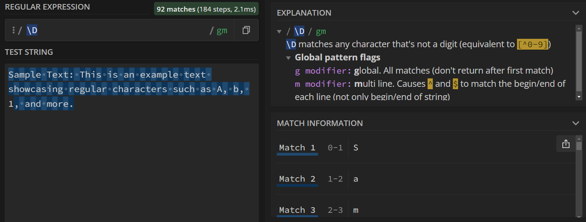
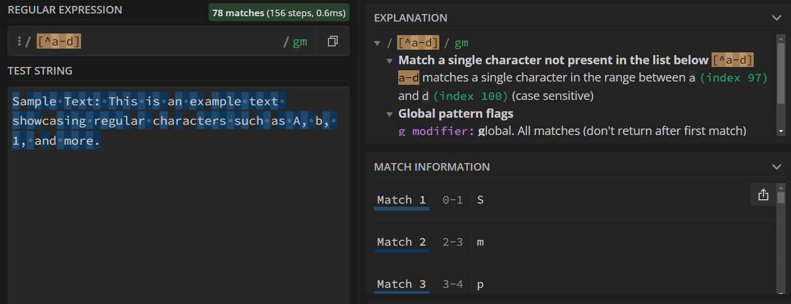

<!-- 
This page is an example lesson template.
Add, edit, or remove any content below for the workshop in question. -->

<!-- Putting a {: .no_toc} above a header removes it from the table of contents -->

{: .no_toc}  
# Lesson 1 - Basic Syntax and Character Matching

A small description about the lesson.

<!-- This is your table of contents. You don't need to touch it, it automatically creates it when you add or remove headers. If you do not want a header to be included, put {: .no_toc } above the header line, as you can see above with Lesson 1 - Lesson Name. Make sure that there's also an empty line above {: .no_toc }... Markdown is picky about this :( -->

  

    Table of Contents
  

  {: .text-delta }
- TOC
{:toc}

<!-- Here are your learning objectives. Just like in the introduction, but more specific for this lesson. -->
## Lesson Objectives
- A learning objective.
- Second learning objective.
- Another learning objective.

<!-- A video for your lesson (if applicable) -->
<!-- ## Lesson Video
The following video demonstrates each of the steps outlined below in text.

<!-- Place iframe of video here -->
<!-- <iframe height="416" width="100%" allowfullscreen frameborder=0 src="https://echo360.ca/media/a65689c0-c35c-4f33-9c12-f0ac97883f54/public?autoplay=false&automute=false"></iframe>
[View original here.](https://echo360.ca/media/a65689c0-c35c-4f33-9c12-f0ac97883f54/public?autoplay=false&automute=false) -->

<!-- Text content format for your lessons if you don't want to rely on videos, or want to provide another format of learning consumption. -->
## Regular Characters

At its simplest, you can simply search for regular characters using regular expressions, much like other search tools (such as your browser's Ctrl+F search). Using any characters from A-Z, a-z, and 0-9 work like usual -- keep in mind that searches are case-sensitive.

For the examples below, we'll search the following text:
> "Sample Text: This is an example text showcasing regular characters such as A, b, 1, and more."

In the search below, we look for any occurrences of the term "example".

In this next example search, we look for any occurrences of the letter "s". Note that it only highlights the lowercase letters.

## Symbols

Some symbols, such as `.`, `?`, and `!`, have a special meaning when using regular expressions. If you simply wanted to search for all occurences of a symbol, preceed the symbol with a backslash (\\).

Below, we show what happens if you simply use "." as your regular expression. Instead of searching for all occurrences of ".", it will highlight every single character.

If you wanted to search for the occurrences of ".", you'll need to add a backslash before the period.

## Metacharacters

Rather than specifying the characters and symbols, you can search for more broad queries. 

### The Dot (.)

The dot (.) matches any singular character, with the exception of newlines. By itself, it can't do much -- it will just highlight the entire text. However, it becomes extremely useful in some contexts, which you'll see later in the module.

The example below uses the search query `i.`, which will return all occurences of the letter "i" followed by any character.

### Whitespace

The \s metacharacter matches any whitespace character, which includes spaces, tabs, newlines, null characters, and carriage returns.

You can also search for any non-whitespace character using \S.

If you are instead searching for a specific whitespace character, you can use...

\n
: Newline

\t
: Tab

\0
: Null character

\r
: Carriage returns

### Digits

The \d metacharacter matches any digit character (0-9).

Like with whitespace, \D searches for any non-digit character.

## Character Sets and Ranges

You can also create your own character sets for which characters to match using square brackets. 

If you want to match several characters sequentially, you can use a character range instead. The range `a-d` searches for the letters a, b, c, and d. The range `a-z` similarly for every **lowercase** letter from a to z.

By adding a caret symbol (^) at the start of your character set, the search will look for any character *except* the characters in the set.

<!-- Summarize your learning objectives here. It acts as a reminder to the learner about what they just learned, as well as a checklist for you to make sure you covered everything you wished to cover. -->
## Key Points / Summary

- Remind the student about what they just learned.
- You can also note down any key information to keep in mind.

