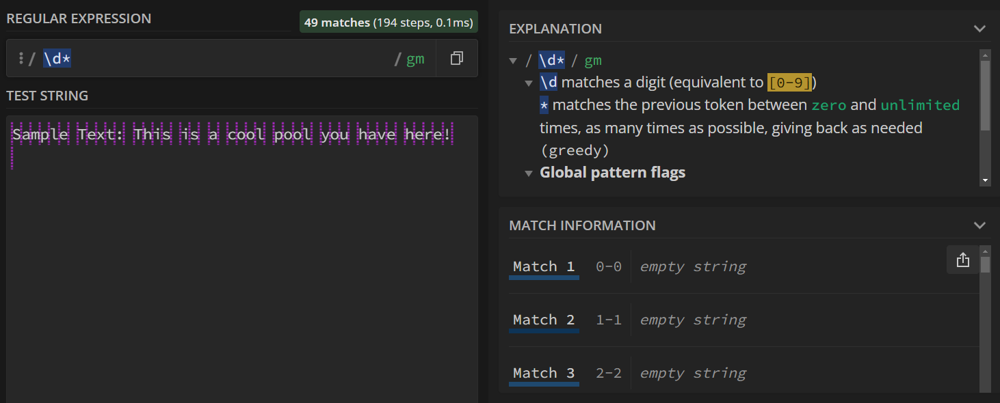

{: .no_toc}  
# Lesson 2 - Quantifiers and Repetition

This lesson will cover quantifers, which will enable you to make more specific and complex search queries.

<details markdown="block" class="toc">
  <summary>
    Table of Contents
  </summary>
  {: .text-delta }
- TOC
{:toc}
</details>

## Lesson Objectives
- Use quantifiers to match several sequential characters.
- Match a pattern that may or may not occur in the test string.
- Differentiate between lazy and greedy quantifiers.

<!-- ## Lesson Video
The following video demonstrates each of the steps outlined below in text.

<iframe height="416" width="100%" allowfullscreen frameborder=0 src="https://echo360.ca/media/a65689c0-c35c-4f33-9c12-f0ac97883f54/public?autoplay=false&automute=false"></iframe>
[View original here.](https://echo360.ca/media/a65689c0-c35c-4f33-9c12-f0ac97883f54/public?autoplay=false&automute=false) -->

## Quantifiers

A quantifier is another type of metacharacter that specifies the number of times a pattern or character should be matched.

### The Asterix (*)

When an asterix proceeds a character, RegEx will try to match the preceeding character zero or more times in a row.

For the examples below, we’ll search the following text:

```
Sample Text: This is a cool pool you have here!
```

The search below looks for all occurrences of the letters p and l, where there's any number of *o*'s in between. This matches the *pl* in the word "exam*pl*e" as well as the word "*pool*".


You might try to use the asterix to search for all numbers by using the `\d*` query. However, the issue here is that it will also match when there are 0 numbers. An example of that is shown below. Despite there being no numbers in the search text, there's still plenty of 0 lengthed matches found.



### The Plus (+)

To solve the issue from the previous section, we now introduce the plus. Similarly to the asterix, when a plus sign proceeds a character, RegEx will match the character **one** or more times. This will prevent the matches with an empty result.


For the examples below, we’ll search the following text:

```
Sample Text: My phone number is 123-456-7890.
```

We use the query `*\\d+-\\d+-\\d+` to find all phone numbers in the format of x-x-x where x is any number of digits.


### The Question Mark (?)

When a pattern may or may not appear, you can use the question mark. This will match a character or pattern zero or one time.


Let's break down the regular expression used above. Here, we want to look for all numbers separated by two -'s, where the first group of numbers may or may not be surrounded by parentheses ( ).  If we want to look for a single parenthesis, we have to add a backslash before them because they too are special characters. Since the parenthesis may or may not occur, we add a `?` symbol after it, to show that it can match zero or one time. We do this for both the opening parenthesis and the closing parenthesis, and we get `\\(?\d+\\)?-\\d+-\\d+`.

{: .note }
> Note that the above expression won't be entirely correct. If the sample text had something like "(455-455-4555" (with a single parenthesis), it would also match to it. The image below shows this. Ideally, we'd want to check whether both occur or neither occur. 
>
> 

### More Specific Quantifiers

For the following examples, the test string used is below.

```
aaaaa
aaaa
aaa
aa
a
```

If you want to match a character *exactly* *x* amount of times, you can use curly brackets -- `{x}`.


You can also specify a range in this way too, from *x* to *y* amount of times (inclusive) -- `{x, y}`.


Lastly, you can also match a character *at least* *x* amount of times -- `{x, }`


## Lazy vs. Greedy Quantifiers

For the following examples, the test string is provided below.

```
(5+3)*(3-2)
```

By default, quantifiers are considered "greedy". When matching a pattern, RegEx will search for the longest possible occurrence that matches your search pattern. This can sometimes be an issue. Suppose we want to match (5+3) and (3-2) separately by looking for an open parenthesis followed by any number of characters and then a closed parenthesis.


Since the `.*` in our regular expression can match any letter, it could also match parentheses. So, when the regular expression looks through our sample text, it finds the first parenthesis, treats everything else in the middle as the . wildcard character, and then matches the final parentheses.

To make a quantifier lazy, you have to add a question mark (?) following the quantifier.


Now, we have two separate matches! One for (5+3), and one for (3-2).

## Key Points / Summary

- The `*`, `+`, and `?` symbols are quantifiers that can specify the number of times a symbol is expected to appear.
- Greedy quantifiers match a pattern as many times as possible, while lazy quantifiers match as few as possible.
