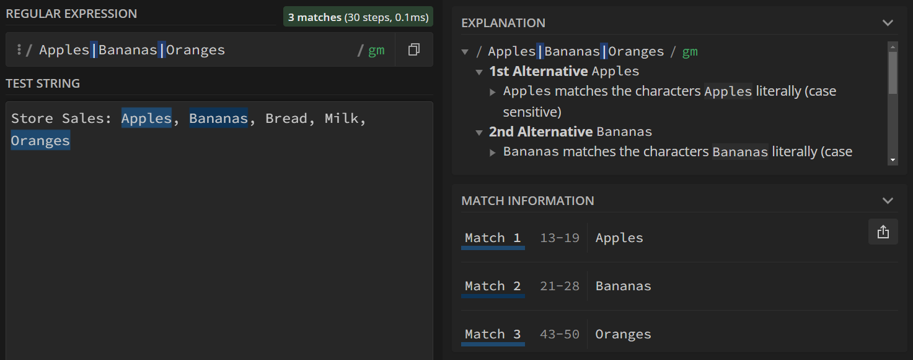
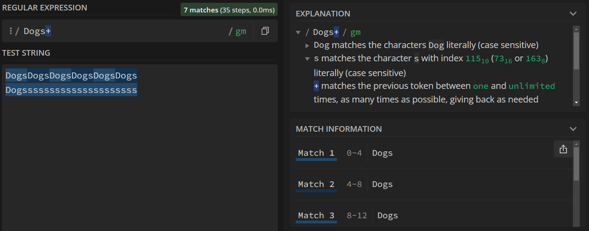
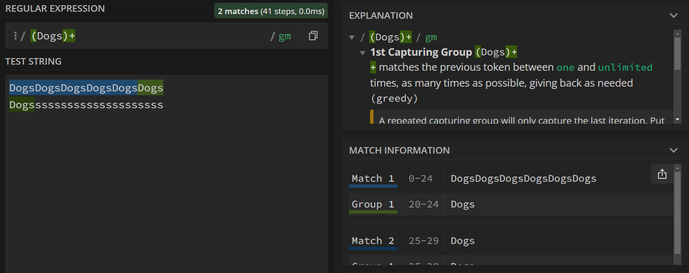
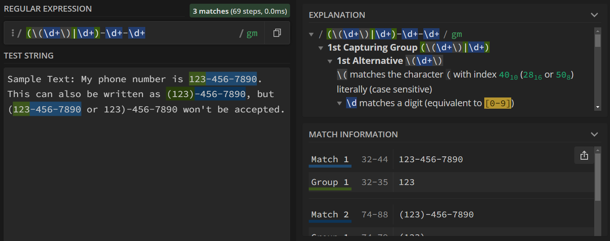
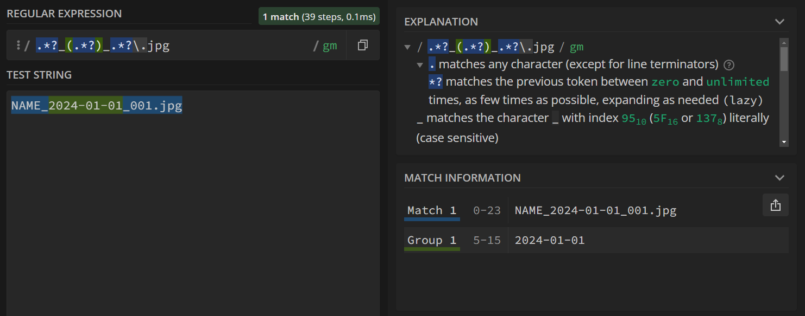
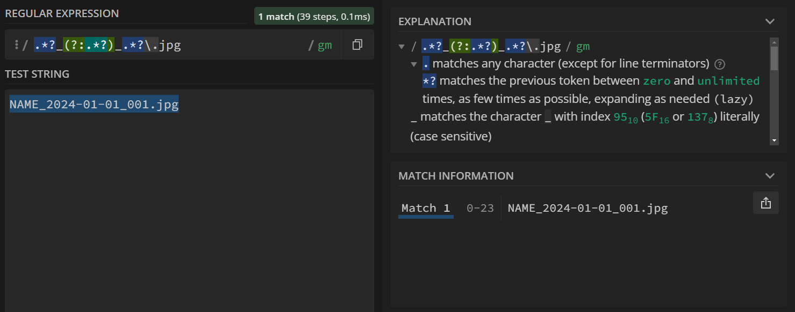
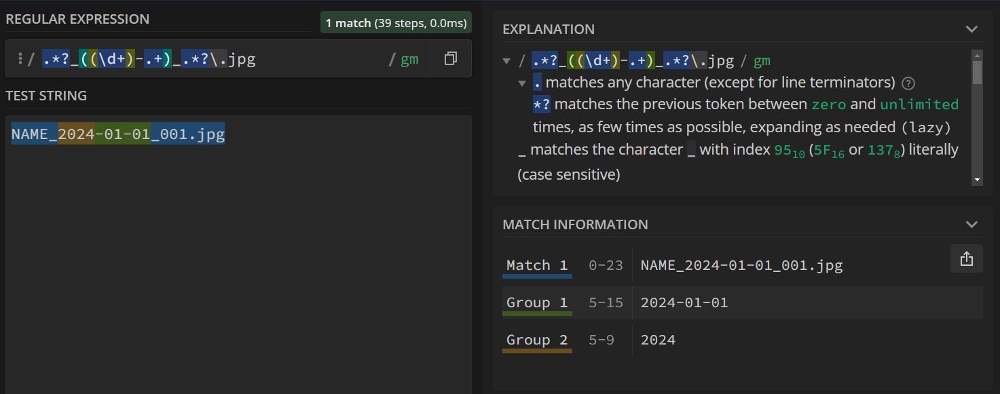

{: .no_toc}  
# Lesson 3 - Alternation and Grouping

Alternation and grouping allows for the creation of more complex search queries that can search for various patterns.

<details markdown="block" class="toc">
  <summary>
    Table of Contents
  </summary>
  {: .text-delta }
- TOC
{:toc}
</details>

## Lesson Objectives
- Use alternation to search for different patterns.
- Apply quantifiers and alternation on groups.
- Capture data using capture groups.

<!-- ## Lesson Video
The following video demonstrates each of the steps outlined below in text.

<iframe height="416" width="100%" allowfullscreen frameborder=0 src="https://echo360.ca/media/a65689c0-c35c-4f33-9c12-f0ac97883f54/public?autoplay=false&automute=false"></iframe>
[View original here.](https://echo360.ca/media/a65689c0-c35c-4f33-9c12-f0ac97883f54/public?autoplay=false&automute=false) -->

## Alternation

With alternation, you can tell RegEx to match one pattern *or* the other. For example, if you wanted to find all occurrences of any fruit, you can split them apart with a pipe character ( \| ) as seen below. 



Above, we search for any occurrence of Apples, Bananas, or Oranges. Keep in mind that this is still case sensitive, so if the test string has "apples" with a lowercase A, it wouldn't match.

## Grouping

### Quantifiers with Groups

If you want to use a quantifier on a group of characters, you can do so by surrounding the group of characters with round brackets ( ) and proceeding the closing bracket with a quantifier.

```
DogsDogsDogsDogsDogsDogs
Dogsssssssssssssssssssss
```

Suppose we wanted to capture all "Dogs" that occur one or more times sequentiallyfrom the text above. If we just did `Dogs+` as our search query, we'd get matches for the word Dogs with one or more 's's. This happens because the quantifier is only applied on the character prior to it.



To fix this, we can put "Dogs" into a group by surrounding it with round brackets, and then apply the quantifier on the group itself. This results in the search query of `(Dogs)+`.




### Alternation with Groups

You can also use groups to limit the extent of alternation. Without groups, RegEx will check for either the left side or the right side of the pipe character, limiting what we can do with it. However, RegEx will stop the alternation search after reaching a bracket, meaning we can expand upon our query.

To show this in action, we return to the phone number example from the previous lesson.

```
Sample Text: My phone number is 123-456-7890. This can also be written as (123)-456-7890, but (123-456-7890 or 123)-456-7890 won't be accepted.
```



Let's break down the regular expression, `(\(\d+\)|\d+)-\d+-\d+`.

- First, we have the group `(\(\d+\)|\d+)`. (you can tell this is a group because it's surrounded by plain round brackets).
  - This group has an alternation, as shown by the pipe character ( \| ). This alternation will either accept `\(\d+\)`, or `\d+`.
    - As we mentioned in the previous lesson, `\(\d+\)` first matches an open bracket (, then any digit one or more times, and then a closed bracket ).
    - `\d+` just matches any digit one or more times.
  - After the group, the rest of the query is the same as before. We look for a -, followed by one or more digits, followed by a -, and finally any number of digits.

You may have also noticed that the valid part of "(123-456-7890" was accepted. This may or may not be fine depending on your usage case. For us, it's a valid case since it only matches the valid portion of the phone number.

### Capture Groups

Some implementations of RegEx allow for "capture groups". In languages like Python and Javascript, you can use capture groups to "capture" pieces of your search query. Any captured text is then saved to some sort of data (variable or otherwise), allowing you to use or manipulate that text as part of a program.

In RegEx101, you can see the captured groups in the "Match Information" tab on the right hand side.

```
NAME_2024-01-01_001.jpg
```



An example of when this could be useful is if you're trying to make a program that searches through a big list of files. You can iterate over every file name and try to search for a key piece of information in its name, like the date or file type. In the picture above, we captured the date information part of the file name. If we only wanted to process files within a specific date range, we can compare this captured date value to the date range we want.

Showing this in use is out of the scope for this module, but you can usually find a lot of information online by searching for "\_\_\_\_ regex" or "\_\_\_\_ regular expression".

### Ignoring Captures

Sometimes, you'll want to use groups without capturing the content. To ignore the content, add `?:` after the first bracket.



### Nesting Capture Groups

Rarely, you might also need to nest capture groups together. The process for this is the exact same.



## Key Points / Summary

- Alternation can be used to specify various patterns.
- Groups allow for the creation of more complicated search queries.
- You can use capture groups in some programs to extract information from search matches.
