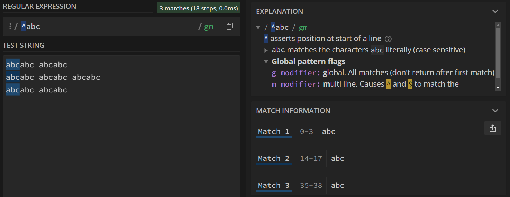
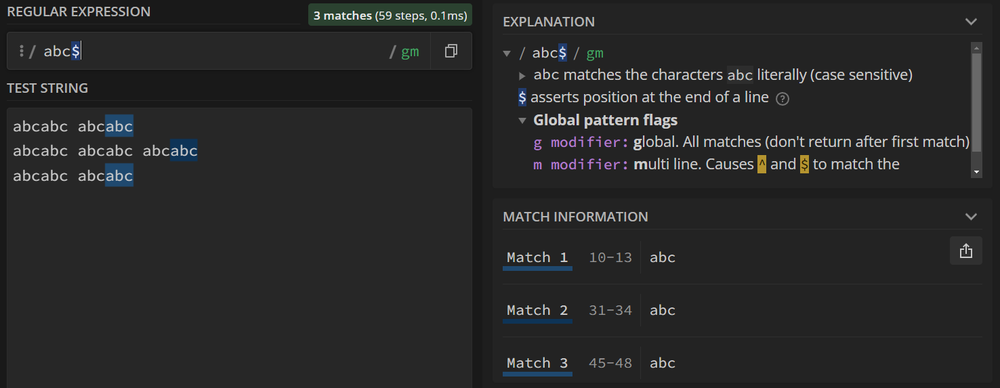
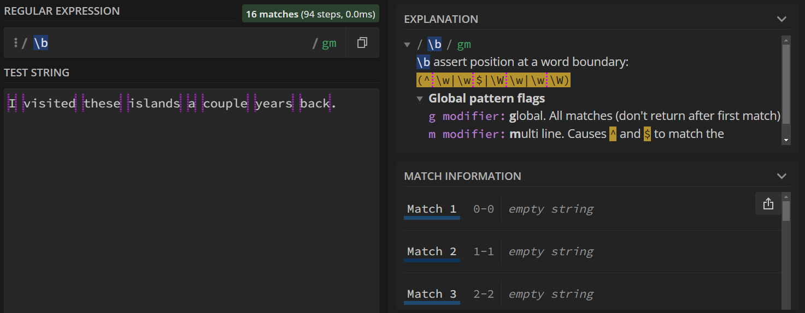
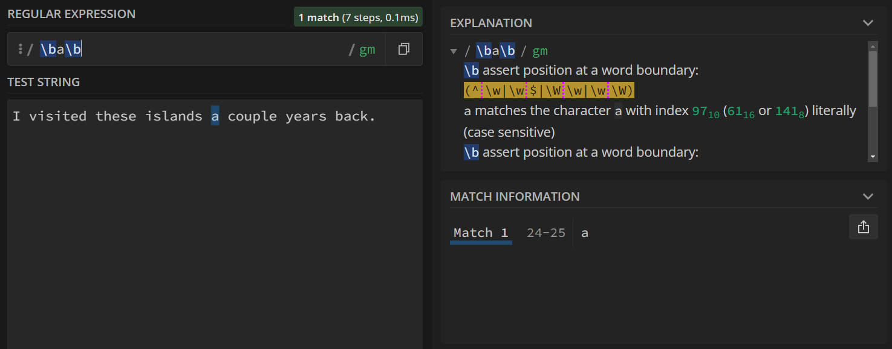

{: .no_toc}  
# Lesson 4 - Anchors and Boundaries

Anchors and boundries can be used to find the edges of words, lines, and texts.

<details markdown="block" class="toc">
  <summary>
    Table of Contents
  </summary>
  {: .text-delta }
- TOC
{:toc}
</details>

## Lesson Objectives
- Match the beginning and end of a line using line anchors.
- Use word boundaries to match words.

## Line Anchors

Line anchors allow us to query for the beginning or the ending of a line.

### The Caret (^)

If you wanted to match the start of a line, you can begin your query with a caret (^).

Search Query: `^abc`    
Test String:  
```
abcabc abcabc
abcabc abcabc abcabc
abcabc abcabc
```



### The Dollar Sign ($)

Similarly, end your query with a dollar sign ($) to match the end of a line.

Search Query: `abc$` 



## Word Boundaries

When searching for a short word, like "is", you'll often find matches that contain "is", such as "island" or "miss". You might then search for " is " (note the spaces), but now you'll miss all the occurences of is that don't necessarily come after a space -- starting a line with is, or ending a sentence with is.

Word boundaries (`\b`) match any non-word characters (such as whitespace and punctuation) that appear right before or right after an alphanumeric character, so you can search for all occurrences of that word without having to worry about the type of character that follows/preceeds it.

By querying for only `\b`, we can see where all the word boundries are for the following sample text.


Search Query: `\b`    
Test String:  
```
I visited these islands a couple years back. 
```



By surrounding your word with word boundaries, it'll specifically search for the full word. Below, we search for all occurrences of the word "a" without matching for the letter a inside 'years' and 'islands',

Search Query: `\ba\b` 




## Key Points / Summary

- Line anchors are used to match the start or end of a line.
- Word boundries can help match full words.
