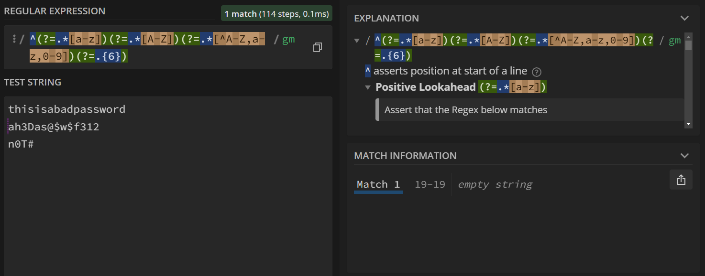

{: .no_toc}  
# Lesson 5 - Lookaheads and Lookbehinds (optional)

A small description about the lesson.

<details markdown="block" class="toc">
  <summary>
    Table of Contents
  </summary>
  {: .text-delta }
- TOC
{:toc}
</details>

## Lesson Objectives
- A learning objective.
- Second learning objective.
- Another learning objective.

## Lookarounds

Lookarounds allow us to make assertions about the text we're searching without "consuming" the text. This allows us to search for text in specific textual contexts without have to capture or match those contexts. Let's take a look at the example below to see this in action.

Search Query: `^.*(?=.png)`

Test String:
```
picture001.png
picture002.png
picture003.jpg
picture004.jpg
picture005.png
```


Above, we have a list of image files, some of which are .png files while others are .jpg files. Suppose we wanted to only match the filename portion (not including the file extension) of all .png files. One way we could achieve this, is by matching any number of characters and then "looking ahead" to see if the next characters include .png, but also not including the .png as part of our match.

Of course, this isn't the only way we could achieve this result. We could have instead used capture groups to capture the file name while still matching the .png separately, as shown below.

Search Query: `(^.*).png`


### Using Lookarounds for Password Verification

A real life use case for lookarounds is to verify that new passwords match certain requirements. For example, many accounts now require you to have some (or all) of these limitations in place when making a password:

- at least one lowercase character
- at least one uppercase character
- at least one symbol
- at least 6 characters long

Individually, it's relatively easy to create a search query that matches each requirement.

- at least one lowercase character: `.*[a-z]`
- at least one uppercase character: `.*[A-Z]`
- at least one symbol: `.*[^A-Z,a-z,0-9]` (any character that is **not** an alphanumeric character)
- at least 6 characters long: `.{6}` 

To get a full password verification, we can just put each one in a lookahead.

Search Query: `^(?=.*[a-z])(?=.*[A-Z])(?=.*[^A-Z,a-z,0-9])(?=.{6})`

Test String:
```
thisisabadpassword
ah3Das@$w$f312
n0T#
```



Since we start our search query with a line anchor (the caret ^), we test the start of each line for a password. "thisisabadpassword" doesn't pass as it only has lowercase letters, and "n0T#" doesn't pass as it isn't 6 characters or longer. However, "ah3Das@$w$f312" passes, as seen by the purple zero-length match at the start of it.

As long as we have a match, the password is valid. It doesn't capture the password itself as part of the match as we're only using lookaheads to test these requirements, however we could just as easily matched the rest of the password by matching any character until the ened of the line after our lookaheads.

## Lookbehinds

Lookbehinds function identically to lookaheads, but they instead assert conditions on text prior to the current position of the search.

Search Query: `(?<=a|i)..`

Test String:
```
abcdefghijklmnop
```


The above query searches for any two characters so long as they're preceeded with the letters a or i.

## Negative Lookarounds

Just like how we can assert whether a condition is true using lookarounds, we can assert whether a condition is false using negative lookarounds.

A negative lookahead is written as `(?!.)`, and a negative lookbehind is written as `(?<!.)`, where `.` is the condition.

Search Query: `(?<!a|i).`

Test String:
```
abcdefghijklmnop
```


The search query above uses a negative lookbehind to match all characters that are not preceeded by the letters a or i.

## Key Points / Summary

- Remind the student about what they just learned.
- You can also note down any key information to keep in mind.
